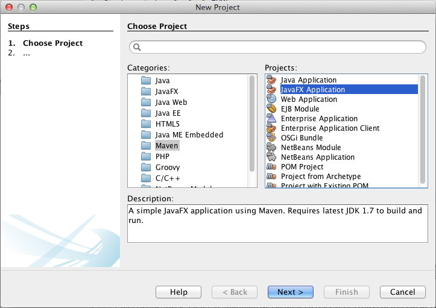
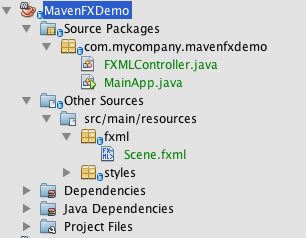
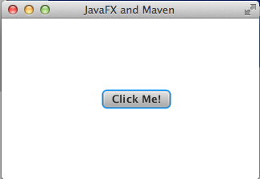
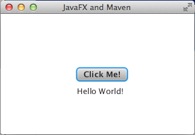
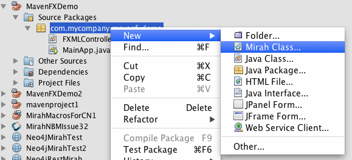
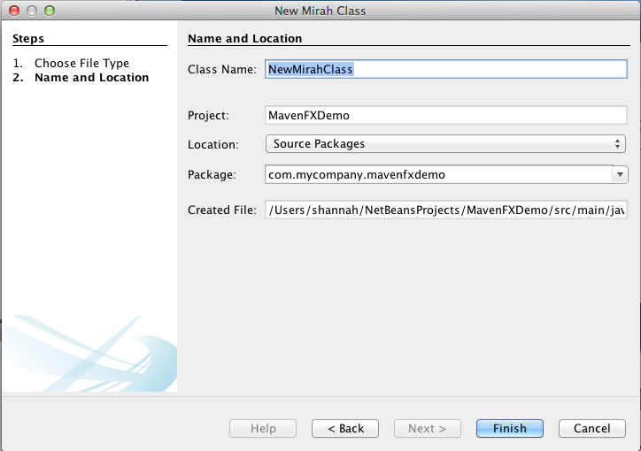
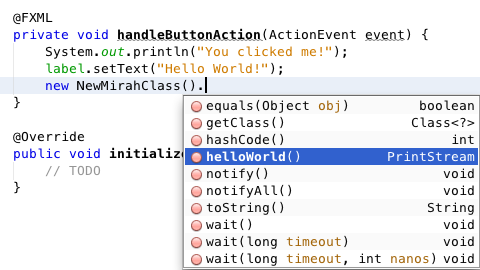
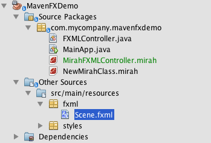
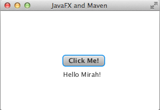

#Maven JavaFX Example

This tutorial describes how to develop a JavaFX application using the [Mirah Netbeans Module](../README.md)

##Background

As of version 1.0.23, the [Mirah Netbeans Module](https://github.com/shannah/mirah-nbm) supports Maven projects.  This opens up a lot of doors, as it allows us to essentially use Mirah inside any Maven project.  Most Java frameworks have Maven support these days, so this means that you can now use Mirah with most frameworks.  In this tutorial I will walk through how to use a Mirah inside a JavaFX Maven project, including how to use a Mirah class as an FXML controller.

##Requirements

1. Netbeans 7.4 or higher
2. Mirah Netbeans Module 1.0.23 or higher
3. A JDK that includes JavaFX  (any Oracle distribution will include this).

##Step One: Create a new Project

In Netbeans, select `File` -> `New Project...`.  Then select the `Maven` category in the *New Project* dialog, and select *JavaFX Application*  as shown below:

Click Next, then enter an appropriate project name.  In this tutorial, I am calling my project "MavenFXDemo".

After completing this dialog, it should generate a project with the following structure:

Nice.  It has generated a default project for us.  If you run this project, at this point, it should open a window with a button as shown below:

After clicking the button, it displays "Hello World" in a label just below the button:

##Step Two: Sprinkle in Some Mirah

Let's begin by creating a simple Mirah class that prints "Hello From Mirah".  Then we'll call this class from our Java controller when the button is clicked.  

1. In the project explorer, expand the *Source Packages* node, then expand the `com.mycompany.mavenfxdemo` package.  Then right click on the `com.mycompany.mavenfxdemo` package and select "New" > "Mirah Class" from the context menu.  (*If "Mirah Class" isn't listed, then select "Other" and select "Mirah Class" from the wizard*):
 
 
 
 Leave the name as "NewMirahClass" for now, and click "Finish" in the dialog:
 
 
2. Implement a method named `helloWorld` inside the Mirah class so that the class should look like:
~~~
package com.mycompany.mavenfxdemo

class NewMirahClass 
  def helloWorld
    puts 'hello from Mirah!'
  end
end
~~~
3. Open the FXMLController class in the editor.  And add the following code inside the `handleButtonAction()` method:
 ~~~
 new NewMirahClass().helloWorld();
 ~~~
 As you're typing, you may notice that the method completion list has already picked up your `NewMirahClass`, and it shows you the `helloWorld` method that you just implemented:
 
 
 The full code for the `FXMLController` class should now be:
 ~~~
 package com.mycompany.mavenfxdemo;

import java.net.URL;
import java.util.ResourceBundle;
import javafx.event.ActionEvent;
import javafx.fxml.FXML;
import javafx.fxml.Initializable;
import javafx.scene.control.Label;

public class FXMLController implements Initializable {
    
    @FXML
    private Label label;
    
    @FXML
    private void handleButtonAction(ActionEvent event) {
        System.out.println("You clicked me!");
        label.setText("Hello World!");
        new NewMirahClass().helloWorld();
    }
    
    @Override
    public void initialize(URL url, ResourceBundle rb) {
        // TODO
    }    
}
 ~~~

##Step 3: Try to run the project

Now try to run the project.  

Unfortunately, you will get a build error like the following:

~~~
------------------------------------------------------------------------
BUILD FAILURE
------------------------------------------------------------------------
Total time: 2.072s
Finished at: Fri Nov 07 13:09:40 PST 2014
Final Memory: 7M/156M
------------------------------------------------------------------------
Failed to execute goal ca.weblite:maven-mirah-plugin:1.0:compile (Compile Mirah Sources) on project MavenFXDemo: Could not find stub for interface Initializable -> [Help 1]
~~~

This failure happens because the JavaFX maven archetype doesn't explicitly add JavaFX as a dependency of the project so Mirah cannot find the classes when it is preprocessing the Java source files.  (Mirah needs to preprocess the Java source files in order to support two-way dependency between Java and Mirah classes).

Mirah will automatically pick up everything in the class path and the boot classpath, but the JavaFX maven plugin here seems to be stealthy and isn't sharing this information with the Mirah plugin.  This is an issue that I'll be looking into for future versions, but for now, this can be solved simply by adding an explicit dependency to the `jfxrt.jar` file in the project's `pom.xml` file as follows:

~~~
    <dependency>
      <groupId>ca.weblite</groupId>
      <artifactId>javafx</artifactId>
      <version>1.0-SNAPSHOT</version>
      <scope>system</scope>
      <systemPath>${java.home}/lib/jfxrt.jar</systemPath>
      <optional>true</optional>
    </dependency>
~~~

The groupId, artifactId, and version can be anything you like.  I just used my own groupId here to avoid conflicts. The important ones here are `scope` and `systemPath`

(This should be placed inside the `<dependencies>` tag of the `pom.xml` file.

> **NOTE** If you are using Java 8, you may need to use `${java.home}/lib/ext/jfxrt.jar` as the path to jfxrt.jar instead of `${java.home}/lib/jfxrt.jar`

> **NOTE 2** You can open up the `pom.xml` file for a project, by right clicking on the project in the project explorer and selecting "Open POM File"

Now let's try to run the project again.  

This time, it should run normally.  And if you click the "Click Me" button, and look at the output console in Netbeans, you should see the following printed:

~~~
You clicked me!
hello from Mirah!
~~~

I.e. That means that it was able to execute Mirah successfully.

##Step 4: Use a Mirah Class as a FXML Controller Class

At this point, we have shown that we can call Mirah from Java.  And you can verify for yourself that you can also call Java code from Mirah.  Let's take it a step further an try to use a Mirah class for the FXML controller.

1. Create a new Mirah class in the same package named *MirahFXMLController*, and add the following content:
~~~
package com.mycompany.mavenfxdemo;

import javafx.event.ActionEvent
import javafx.fxml.FXML
import javafx.scene.control.Label

class MirahFXMLController 
  def initialize
    $FXML
    @label = Label(nil)
  end
    
    
  $FXML
  def handleButtonAction(event:ActionEvent):void
    puts 'You clicked me !'
    @label.setText "Hello Mirah!"
  end
  
end

~~~
 
 There are a couple of things to note here:
 
 1. I have tried to keep this functionally equivalent to the original Java FXMLController class, but there are a couple of changes noted below.
 2. I have removed the initialize(URL,ResourceBundle) method because the name `initialize` conflicts with the Mirah constructor methods.  Luckily JavaFX no longer requires its controllers to implement the `Initializable` interface.
 3. This class does not implement the `Initializable` interface.
 4. In Mirah, the `@FXML` annotation is written as `$FXML`
 5. Notice that the `$FXML1` annotation is placed just before the assignment of the `@label` member variable - which is inside the `initialize` method.  This differs from the Java placement outside of functions.  This is because Mirah doesn't have member declarations in the root class space like Java does.  Member vars and types are automatically created and inferred in Mirah based on the types that are assigned to them.
2. Open the `Scene.fxml` file in Scene Builder by double clicking inside the project explorer.
 
 
 
 After opening, scene builder, expand the *Code* section of the *Inspector* (as shown below), and change the name of the controller class from "FXMLController" to "MirahFXMLController":
 
 
 
 Save the file when done, in Scene Builder. (E.g. `File` > `Save`).
 
Once you have finished saving the Scene.fxml file in Scene Builder, return to Netbeans and try to run the project again.  It should run the same as before, except this time when you click the button it says "Hello Mirah!" instead of "Hello World!" (because it is using the Mirah class as a controller).

##Summary

Now that you know how to include Mirah inside your JavaFX projects, and use Mirah classes as FXML controller, you are ready to rock and roll.  See how much more productive you can be when you are coding in Mirah.  You can still use Java for things that make sense, but you are free to code portions of your app in Mirah without giving up all of your Java Tools.

Have fun!

##Other Resources

1. [The Mirah Website](http://mirah.org)
2. [JavaFX Overview](http://docs.oracle.com/javase/8/javafx/get-started-tutorial/jfx-overview.htm#JFXST784)

##Contact

This tutorial written by [Steve Hannah](http://sjhannah.com)
 

